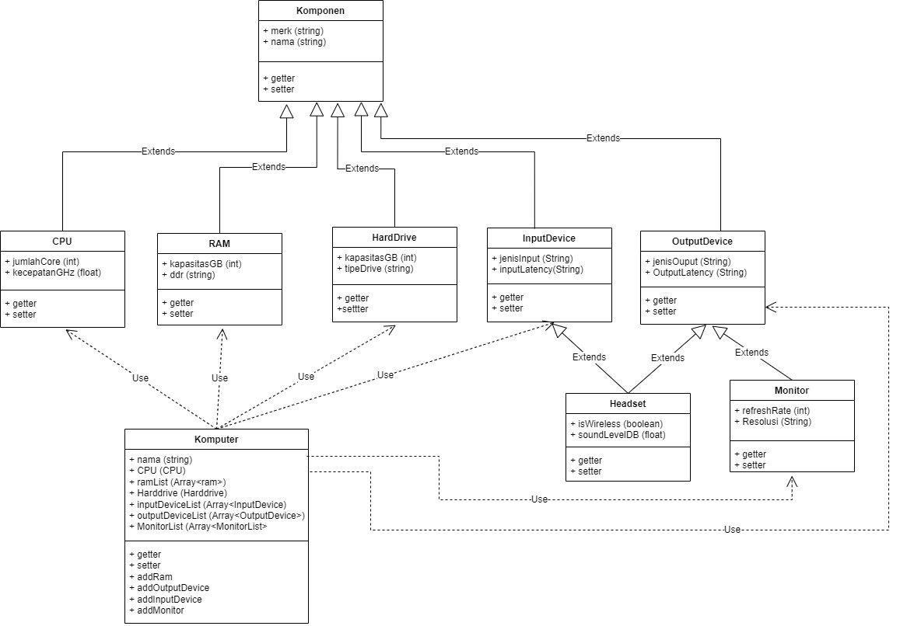
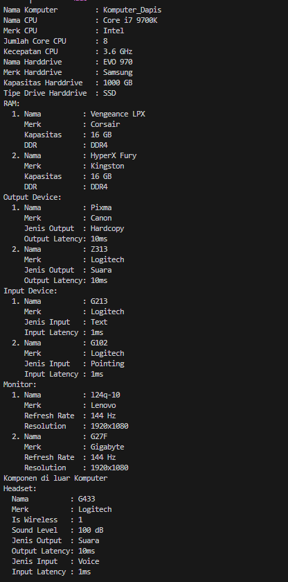
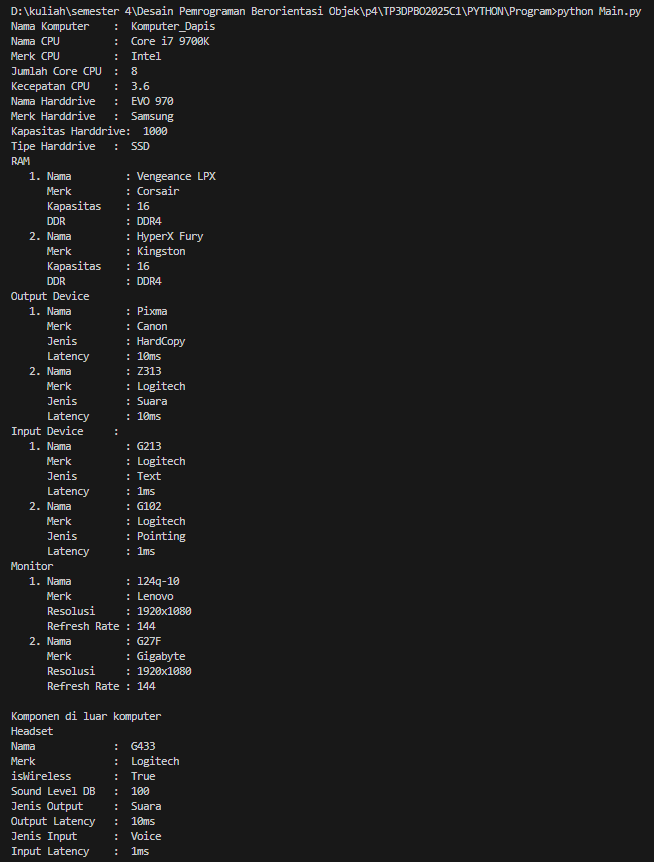
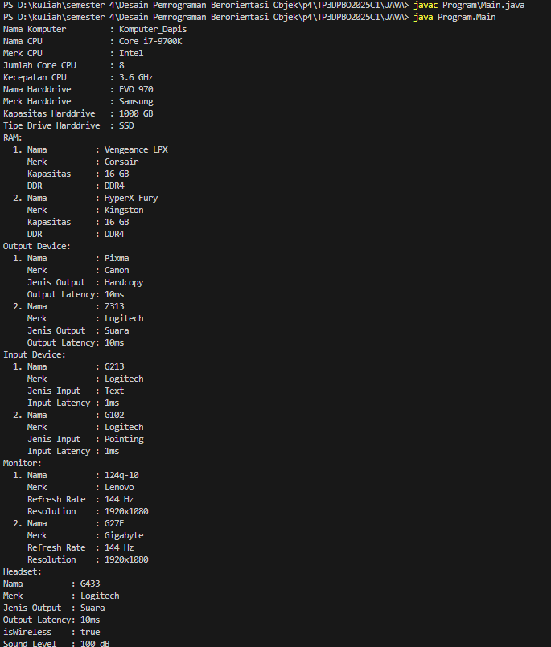

# Tugas Praktikum 3 DPBO 2025 C1  
Ilmu Komputer Universitas Pendidikan Indonesia

## Janji  
Saya, **Raffi Adzril Alfaiz** dengan NIM **2308355**, mengerjakan Tugas Praktikum 3 dalam mata kuliah **Desain dan Pemrograman Berorientasi Objek** untuk keberkahan-Nya. Maka saya tidak melakukan kecurangan seperti yang telah dispesifikasikan. Aamiin.

---

## Class Diagram

### Alasan Desain Diagram
#### 1. Hierarchical Inheritance
Saya membuat class baru yaitu Monitor, Headset, InputDevice dan OutputDevice sebagai contoh dari penerapan konsep ini. Monitor dan Headset diwarisi Komponen juga InputDevice/OutputDevice. Sehingga memenuhi konsep Hierarchical Inheritance.
#### 2. Multiple Inheritance
Class Headset memenuhi konsep Multiple, karena 1 child yang memiliki 2 parent. 
#### 3. Hybrid Inheritance
Dari keseluruhan konsep yang diimplementasikan terdapat lebih dari 1 konsep, sehingga memenuhi hybrid Inheritance
#### 4. Alasan Pembuatan Class Baru
Input device dan Output Device juga merupakan bagian dari komponen komputer, maka dari itu dibuatlah kelas baru. Headset merupakan input device dan juga output device karena dia bisa menghasilkan suara dari microphonenya dan juga dapat mendengar suara yang dihasilkan. Monitor saya tambahkan untuk Output device karena ada atribut tersendiri dari Monitor yang tidak dimiliki Output Device lainnya seperti refresh rate dan resolusi.
#### 5. Composite
Komputer composite ke hampir semua komponen kecuali headset, alasannya karena komputer bisa saja memakai speaker, tidak selalu memakai headset

---

## Screenshot Hasil Program

### CPP

### Python

### Java

---

## Alur Kode

Berikut adalah isi dari atribut setiap class

| Class         | Atribut              | Tipe Data         |
|---------------|----------------------|-------------------|
| **Komponen**  | `merk`               | string            |
|               | `nama`               | string            |
| **CPU**       | `jumlahCore`         | int               |
|               | `kecepatanGHz`       | float             |
| **RAM**       | `kapasitasGB`        | int               |
|               | `ddr`                | string            |
| **HardDrive** | `kapasitasGB`        | int               |
|               | `tipeDrive`          | string            |
| **InputDevice** | `jenisInput`       | string            |
|               | `inputLatency`       | string            |
| **OutputDevice** | `jenisOutput`     | string            |
|               | `outputLatency`      | string            |
| **Headset**   | `isWireless`         | boolean           |
|               | `soundLevelDB`       | float             |
| **Monitor**   | `refreshRate`        | int               |
|               | `resolusi`           | string            |
| **Komputer**  | `nama`               | string            |
|               | `CPU`                | CPU               |
|               | `ramList`            | Array of RAM      |
|               | `hardDrive`          | HardDrive         |
|               | `InputDeviceList`    | Array of InputdDevice|
|               | `OutputDeviceList`   | Array of OutputdDevice|
|               | `MonitorList`        | Array of Monitor      |

--- 

### Main Program
1. **Import Class**
   - Mengimpor class: `CPU`, `Ram`, `Harddrive`, `Komputer`, `OutputDevice`, `InputDevice`, `Monitor`, `Headset`.

2. **Instansiasi Komponen**
   - Membuat objek: CPU, RAM, Harddrive, Input Device (keyboard, mouse), Output Device (printer, speaker), Monitor, dan Headset.

3. **Pembuatan Objek Komputer**
   - Membuat objek `Komputer` dengan komponen yang sudah dibuat.
   - Menambahkan speaker ke daftar output device.

4. **Menampilkan Spesifikasi Komputer**
   - Menampilkan informasi CPU, Harddrive, RAM, Input/Output Device, dan Monitor dari objek `Komputer`.

5. **Menampilkan Komponen Tambahan**
   - Menampilkan detail headset secara terpisah (karena bersifat hybrid: input & output).

##  Output Program
Program mencetak spesifikasi lengkap dari komputer beserta perangkat pendukungnya ke layar terminal.
